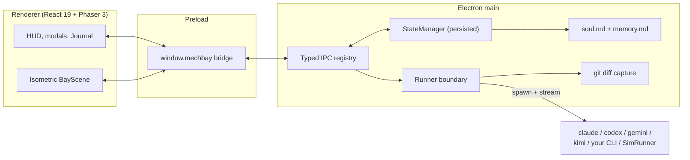

# MechBay

[](https://github.com/samalbanese/mechbay/actions/workflows/ci.yml)

_A BattleTech-inspired command bay for AI coding agents._

MechBay is an Electron desktop app for deploying real coding agents as mech-class companions. Drag a mech onto an isometric facility that represents a real project directory, give it a task, and follow the live output in the command-bay HUD.


_Everything above is the real app: a mech deployed onto a facility, a live mission log, and a Mission Debrief backed by an actual git diff. Captured start-to-finish by `npm run capture:demo`._

## Try it in 60 seconds — no API keys

You don't need any agent CLI installed to feel the loop:

```bash
git clone https://github.com/samalbanese/mechbay.git
cd mechbay
npm install
npm run demo
```

Demo mode boots the bay with a built-in simulation runtime behind every mech. Drag any mech onto the seeded Reactor Control facility: it walks over, streams a scripted mission log in that mech's voice, edits real files in a real git-initialized workspace, and returns with a Mission Debrief showing a genuine diff. Nothing downstream of the runner is mocked — demo mode swaps only the agent process itself. Your real bay state is untouched (demo persists to a separate store), and the HUD shows a `◈ SIMULATION` badge so there's no confusion about which world you're in.

Have a real agent CLI installed? `npm run dev` and deploy for real.

## What it does

- Deploys real local agent processes into real project directories.
- Maps five named mechs to Claude Code, Codex, Kimi on Fireworks AI, Gemini CLI, or any command-line agent you bring yourself.
- Streams live output to the HUD; Raven can also show opt-in `INTENT` and `FINDINGS` thought cards.
- Runs up to three deployments at once and places the rest in a FIFO queue.
- Captures a Mission Debrief after every run: changed files, insertions, deletions, and a per-file diff table.
- Keeps each mech's `soul.md` and `memory.md` between deployments, with an in-app Journal for editing both.
- Handles the rough edges: dead-in-field failure states, click-to-recover, and a crash-recovery modal on the next launch.
- Lets you browse facility files read-only through a whitelist guard, bulk import projects, click an empty bay tile to add a facility from a directory picker, or click an unlinked starter building to connect it to a project directory.
- Lets you rename mechs and optionally store runtime API keys encrypted by the OS; keys are injected only into that mech's process when a deployment launches.

## The mechs

| Mech           | Class role        | Runtime               | Requirements                                                       |
| -------------- | ----------------- | --------------------- | ------------------------------------------------------------------ |
| Atlas-Prime    | Heavy assault     | Claude Code           | `claude` on `PATH`                                                 |
| Marauder-Prime | Surgical strike   | Codex                 | `codex` on `PATH`                                                  |
| Raven-Prime    | Recon scout       | Kimi via Fireworks AI | `python` on `PATH` and a stored or environment `FIREWORKS_API_KEY` |
| Catapult-Prime | Ranged multimodal | Gemini CLI            | `gemini` on `PATH`                                                 |
| Locust-Prime   | Swarm courier     | Bring your own agent  | `MECHBAY_HERMES_CMD` set to a CLI command line                     |

An unconfigured mech shows `⚠ NOT DEPLOYABLE`. The rest of the bay remains usable.

_Runtime integrations verified as of July 2026; MechBay degrades any unavailable runtime to NOT DEPLOYABLE rather than failing._

## Any mech, any runtime (bring your own key)

Every mech's runtime is reassignable from the UI — you're not stuck with the family it launched with. Select a mech, open its panel, and the **RUNTIME** section lets you:

- Pick any of the five runtimes from a dropdown (the mech's native family is marked `— DEFAULT`).
- Set an optional model override, passed straight through to that runtime's CLI:

| Runtime          | Model flag                                    |
| ---------------- | --------------------------------------------- |
| Claude Code      | `--model`                                     |
| Codex            | `-m`                                          |
| Gemini CLI       | `-m`                                          |
| Kimi (Fireworks) | `--model`                                     |
| Custom CLI       | `{MODEL}` placeholder in `MECHBAY_HERMES_CMD` |

Press **APPLY** and MechBay re-probes availability for the new runtime immediately — the availability badge updates without a restart.

Open **⚙ SETTINGS** to rename mechs and manage runtime credentials. Claude Code
continues to use its own login. For Codex, Gemini, Kimi, and custom runtimes,
MechBay can store a key encrypted by Electron's OS-backed `safeStorage`
(Windows DPAPI on Windows) and inject it only into that mech's process at
launch. Keys are never written in plain text or exposed back to the renderer.
Stored keys are optional: existing environment variables keep working when no
stored key exists. When both are present, the stored key wins because it is the
explicit in-app choice.

## Quickstart (real agents)

Requirements: Node.js 20+, npm, and git on `PATH` (git powers Mission Debrief). MechBay runs on Windows, macOS, and Linux; it is developed on Windows. Install at least one runtime from the table above.

```bash
git clone https://github.com/samalbanese/mechbay.git
cd mechbay
npm install
npm run dev
```

## How it's built



One `Runner` interface is the entire boundary between MechBay and the outside world — Claude Code, Codex, Gemini, Kimi, a bring-your-own CLI, and the demo-mode simulator are each a drop-in implementation of it. Everything crossing the Electron IPC boundary is a serializable type declared in one shared registry, and every channel name lives in a single constants file. The suite is 297 unit and integration tests plus a typecheck gate on CI.

## Status

**v1.3 — feature-complete MVP with in-app mech and bay configuration.**

## Configuring runtimes

MechBay checks runtime availability at startup. Install each CLI and make sure
its command is available on `PATH` before launching the app. Authenticate with
the runtime's own login, an environment variable, or an encrypted key saved in
**⚙ SETTINGS** where supported.

- **Atlas-Prime / Claude Code:** install Claude Code so `claude` runs from a terminal.
- **Marauder-Prime / Codex:** install the Codex CLI so `codex` runs from a terminal.
- **Catapult-Prime / Gemini:** install Gemini CLI so `gemini` runs from a terminal.
- **Raven-Prime / Kimi:** MechBay runs the bundled `scripts/kimi_fireworks.py` wrapper. It needs `python` on `PATH` and a Fireworks key. The wrapper gives Kimi a full agentic tool loop, and MechBay enables its `--narrate` mode automatically so Raven's `▸ INTENT` and `◆ FINDINGS` thought cards stream into the live log.
- **Locust-Prime / bring your own agent:** set `MECHBAY_HERMES_CMD` to any CLI command line. If it contains `{PROMPT}`, MechBay substitutes the task there. Otherwise it pipes the task prompt to the command's standard input. If the command line also contains `{MODEL}`, MechBay substitutes the model override there when one is set; if no override is set, the `{MODEL}` token is dropped cleanly (and if the command line has no `{MODEL}` placeholder at all, any model override is simply ignored).

For example, in PowerShell before starting MechBay:

```powershell
$env:FIREWORKS_API_KEY = "your-fireworks-key"
$env:MECHBAY_HERMES_CMD = "aider"
# Or let the command receive the task as an argument:
$env:MECHBAY_HERMES_CMD = "opencode {PROMPT}"
```

`aider`, `goose`, `opencode`, and your own scripts can all work as Locust runtimes if they accept either standard input or a substituted `{PROMPT}` argument.

## Mission Debrief, souls, and memory

When a mech returns, MechBay runs a git diff in that facility and opens a **MISSION DEBRIEF** modal with file-level change stats. A check-mark speech bubble appears over the returning mech, and the outcome is written to that mech's `memory.md`.

Each companion also has a `soul.md`: its persona and working voice. Both files are included in the next deployment's context. Use the Journal tab to read or edit them without leaving the app.

## Project structure

```
src/
  main/              Electron process, IPC handlers, persistence, runners, and filesystem access
    runners/         Shared runner base plus Claude, Codex, Kimi, Gemini, and BYO-agent runtimes
  preload/           Safe window.mechbay bridge between Electron and the renderer
  renderer/
    src/             React command-bay UI, Phaser scene, HUD, modals, Journal, and File Browser
  shared/            Serializable types, defaults, IDs, and the single IPC channel registry
test/
  unit/              Unit coverage for runners, state, log narration, filesystem access, and UI helpers
  integration/       Deployment lifecycle coverage
assets/              Mech and facility sprites
scripts/             Kimi Fireworks wrapper and chromakey utility
docs/
  DECISIONS.md       Architecture and product decisions
  manual-smoke-tests.md  Release smoke-test checklist
  history/           Archived project handoffs and overnight reports
```

## Development

```bash
npm run dev          # start Electron with hot reload
npm run demo         # start in demo mode — every mech deployable, no API keys
npm run capture:demo # record docs/demo.gif automatically (Playwright + ffmpeg)
npm run typecheck    # type-check main and renderer code
npm test             # run the Vitest suite
npm run test:watch   # run Vitest in watch mode
npm run build        # type-check and build to out/
npm run build:win    # build a Windows installer
npm run build:mac    # build a macOS package
npm run build:linux  # build a Linux package
npm run chromakey    # process mech and facility sprites
```

Before publishing a change, use the manual release checklist in [docs/manual-smoke-tests.md](docs/manual-smoke-tests.md).

## Development history

MechBay's six MVP waves built the Electron deployment plumbing, isometric game layer, asset pass, runtime roster and queue, companion memory plus file browsing, then release polish and recovery flows.

The decisions behind those waves, including tradeoffs and deferred ideas, live in [docs/DECISIONS.md](docs/DECISIONS.md).

## License

MIT. See [LICENSE](LICENSE).

MechBay is a fan-inspired project and is not affiliated with, endorsed by, or connected to Topps, Catalyst Game Labs, or the BattleTech franchise. All mech and facility art is original, AI-generated work.

## Why

I wanted my AI agents to feel like companions, not buttons.
