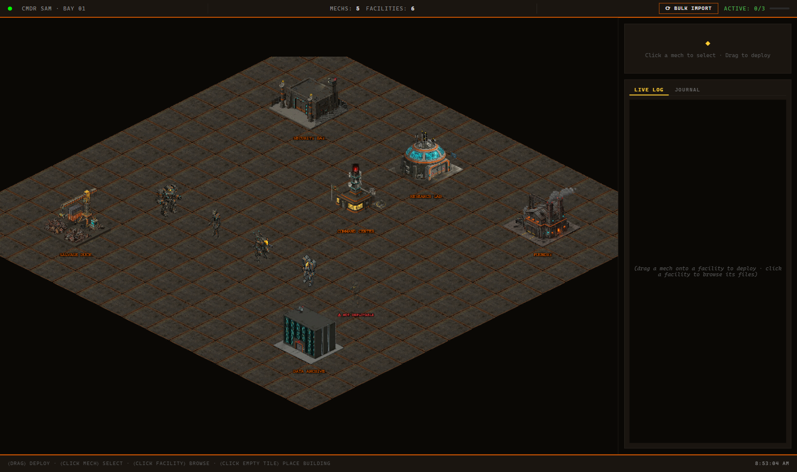

# MechBay

*Battletech for AI coding agents.*

MechBay is an Electron desktop app for deploying real coding agents as mech-class companions. Drag a mech onto an isometric facility that represents a real project directory, give it a task, and follow the live output in the command-bay HUD.



*Demo gif coming soon.*

## What it does

- Deploys real local agent processes into real project directories.
- Maps five named mechs to Claude Code, Codex, Kimi on Fireworks AI, Gemini CLI, or any command-line agent you bring yourself.
- Streams live output to the HUD; Raven can also show opt-in `INTENT` and `FINDINGS` thought cards.
- Runs up to three deployments at once and places the rest in a FIFO queue.
- Captures a Mission Debrief after every run: changed files, insertions, deletions, and a per-file diff table.
- Keeps each mech's `soul.md` and `memory.md` between deployments, with an in-app Journal for editing both.
- Handles the rough edges: dead-in-field failure states, click-to-recover, and a crash-recovery modal on the next launch.
- Lets you browse facility files read-only through a whitelist guard, bulk import projects, click an empty bay tile to add a facility from a directory picker, or click an unlinked starter building to connect it to a project directory.

## The mechs

| Mech | Class role | Runtime | Requirements |
| --- | --- | --- | --- |
| Atlas-Prime | Heavy assault | Claude Code | `claude` on `PATH` |
| Marauder-Prime | Surgical strike | Codex | `codex` on `PATH` |
| Raven-Prime | Recon scout | Kimi via Fireworks AI | `python` on `PATH` and `FIREWORKS_API_KEY` |
| Catapult-Prime | Ranged multimodal | Gemini CLI | `gemini` on `PATH` |
| Locust-Prime | Swarm courier | Bring your own agent | `MECHBAY_HERMES_CMD` set to a CLI command line |

An unconfigured mech shows `⚠ NOT DEPLOYABLE`. The rest of the bay remains usable.

## Any mech, any runtime (bring your own key)

Every mech's runtime is reassignable from the UI — you're not stuck with the family it launched with. Select a mech, open its panel, and the **RUNTIME** section lets you:

- Pick any of the five runtimes from a dropdown (the mech's native family is marked `— DEFAULT`).
- Set an optional model override, passed straight through to that runtime's CLI:

| Runtime | Model flag |
| --- | --- |
| Claude Code | `--model` |
| Codex | `-m` |
| Gemini CLI | `-m` |
| Kimi (Fireworks) | `--model` |
| Custom CLI | `{MODEL}` placeholder in `MECHBAY_HERMES_CMD` |

Press **APPLY** and MechBay re-probes availability for the new runtime immediately — the availability badge updates without a restart.

Auth is always the runtime's own — `claude`/`codex` login, `GEMINI_API_KEY`, `FIREWORKS_API_KEY`, or your custom CLI's own environment. MechBay never stores keys; it only remembers which runtime and model you assigned to each mech.

## Quickstart

Requirements: Node.js 20+, npm, and git on `PATH` (git powers Mission Debrief). MechBay runs on Windows, macOS, and Linux; it is developed on Windows. Install at least one runtime from the table above.

```bash
git clone https://github.com/samalbanese/mechbay.git
cd mechbay
npm install
npm run dev
```

## Status

**v1.0 — feature-complete MVP.**

## Configuring runtimes

MechBay checks runtime availability at startup. Install and authenticate each CLI using its own instructions, then make sure its command is available on `PATH` before launching the app.

- **Atlas-Prime / Claude Code:** install Claude Code so `claude` runs from a terminal.
- **Marauder-Prime / Codex:** install the Codex CLI so `codex` runs from a terminal.
- **Catapult-Prime / Gemini:** install Gemini CLI so `gemini` runs from a terminal.
- **Raven-Prime / Kimi:** MechBay runs the bundled `scripts/kimi_fireworks.py` wrapper. It needs `python` on `PATH` and a Fireworks key. The wrapper gives Kimi a full agentic tool loop, and MechBay enables its `--narrate` mode automatically so Raven's `▸ INTENT` and `◆ FINDINGS` thought cards stream into the live log.
- **Locust-Prime / bring your own agent:** set `MECHBAY_HERMES_CMD` to any CLI command line. If it contains `{PROMPT}`, MechBay substitutes the task there. Otherwise it pipes the task prompt to the command's standard input. If the command line also contains `{MODEL}`, MechBay substitutes the model override there when one is set; if no override is set, the `{MODEL}` token is dropped cleanly (and if the command line has no `{MODEL}` placeholder at all, any model override is simply ignored).

For example, in PowerShell before starting MechBay:

```powershell
$env:FIREWORKS_API_KEY = "your-fireworks-key"
$env:MECHBAY_HERMES_CMD = "aider"
# Or let the command receive the task as an argument:
$env:MECHBAY_HERMES_CMD = "opencode {PROMPT}"
```

`aider`, `goose`, `opencode`, and your own scripts can all work as Locust runtimes if they accept either standard input or a substituted `{PROMPT}` argument.

## Mission Debrief, souls, and memory

When a mech returns, MechBay runs a git diff in that facility and opens a **MISSION DEBRIEF** modal with file-level change stats. A check-mark speech bubble appears over the returning mech, and the outcome is written to that mech's `memory.md`.

Each companion also has a `soul.md`: its persona and working voice. Both files are included in the next deployment's context. Use the Journal tab to read or edit them without leaving the app.

## Project structure

```
src/
  main/              Electron process, IPC handlers, persistence, runners, and filesystem access
    runners/         Shared runner base plus Claude, Codex, Kimi, Gemini, and BYO-agent runtimes
  preload/           Safe window.mechbay bridge between Electron and the renderer
  renderer/
    src/             React command-bay UI, Phaser scene, HUD, modals, Journal, and File Browser
  shared/            Serializable types, defaults, IDs, and the single IPC channel registry
test/
  unit/              Unit coverage for runners, state, log narration, filesystem access, and UI helpers
  integration/       Deployment lifecycle coverage
assets/              Mech and facility sprites
scripts/             Kimi Fireworks wrapper and chromakey utility
docs/
  DECISIONS.md       Architecture and product decisions
  manual-smoke-tests.md  Release smoke-test checklist
  history/           Archived project handoffs and overnight reports
```

## Development

```bash
npm run dev          # start Electron with hot reload
npm run typecheck    # type-check main and renderer code
npm test             # run the Vitest suite
npm run test:watch   # run Vitest in watch mode
npm run build        # type-check and build to out/
npm run build:win    # build a Windows installer
npm run build:mac    # build a macOS package
npm run build:linux  # build a Linux package
npm run chromakey    # process mech and facility sprites
```

Before publishing a change, use the manual release checklist in [docs/manual-smoke-tests.md](docs/manual-smoke-tests.md).

## Development history

MechBay's six MVP waves built the Electron deployment plumbing, isometric game layer, asset pass, runtime roster and queue, companion memory plus file browsing, then release polish and recovery flows.

The decisions behind those waves, including tradeoffs and deferred ideas, live in [docs/DECISIONS.md](docs/DECISIONS.md).

## License

MIT. See [LICENSE](LICENSE).

## Why

I wanted my AI agents to feel like companions, not buttons.
